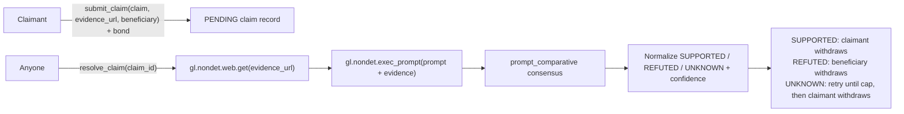

# Bonded Claim Slashing

A GenLayer Intelligent Contract that lets a claimant back a factual claim with a real GEN bond, and lets validator consensus decide — from fetched evidence, not from the claimant's word — whether that bond goes back to the claimant or gets slashed to a named beneficiary. Any dispute registry, grant program, bounty board, or reporting market that currently has to trust one arbitrator to read evidence and move money can import this instead.

## The problem it removes

Picture a grant program: a grantee claims "I shipped milestone 4," points at a public status page, and asks for their bond back. Someone has to read that page and decide if the claim holds. If that someone is the program operator, the operator is also the payer — the party judging the evidence is the party who benefits from a stingy verdict. If it's a hired arbitrator, the grantee and the program both have to trust a third party they don't control and can't audit. Either way, one entity's read of the evidence becomes the payout, and the losing side has no way to know whether they were shorted.

## Why this needs consensus, not a backend

Delete GenLayer from this picture and a single party — a script, a moderator, an oracle operator — reads the evidence page and decides. Every counterparty who isn't that party has to trust them. That is exactly two mutually distrusting parties (claimant and beneficiary, who profit from opposite verdicts) depending on one answer, where the claimant supplies part of the input (the claim text) and neither side controls the fetch. A price oracle can't help here — there's no price. A hash can't help — the evidence is prose, not a fixed byte string to check for tampering. A deterministic parser can't help — "does this page support this specific claim" is not a syntax question, it is a reading-comprehension one. An optimistic oracle with human disputes reintroduces exactly the arbitration problem this contract removes. A single LLM call off-chain produces an opinion nobody but its caller can verify or hold to account. A multisig of reporters is a vote among appointed people, not a judgement anchored in the fetched page. GenLayer's validator set reads the same evidence and reaches consensus on the same semantic question, and the bond and the verdict live in the same trust domain — no one has to additionally trust whoever moves the money, because the contract moves it according to what validators already agreed on.

## What this is not

- **Not a change-detector.** It doesn't watch a page over time or compare snapshots; it judges one fetch against one claim, once (or a bounded number of retries).
- **Not a corroboration/reputation oracle.** It doesn't cross-reference multiple sources or track source trustworthiness; it reads exactly the URL the claimant supplied.
- **Not an "AI app with GenLayer attached."** The output isn't advice a human reads and acts on — `resolve_claim` deterministically unlocks or redirects a real GEN bond. Remove the bond and the contract has nothing left to do.
- **Not a format validator.** The equivalence principle (below) is written over the verdict's *meaning* — same conclusion, same confidence band, same material facts — never over "is this valid JSON."
- **Not judging the claimant's word alone.** `submit_claim` requires an `evidence_url`; `resolve_claim` fetches it server-side inside consensus. The model is shown fetched evidence, not asked to take the claim on faith.

## How it works



`submit_claim` is a payable write: it takes the bond as `gl.message.value`, validates the claim text and the `https://` evidence URL, and stores an immutable `PENDING` record. `resolve_claim` is permissionless — anyone can pay the gas to trigger resolution, so the claimant is never blocked waiting on the beneficiary (or vice versa) to move things forward. Resolution fetches the evidence URL and asks the model a single, narrow question inside one `prompt_comparative` round. `withdraw` then lets exactly the correct party pull the bond once the claim is terminal. A retryable `UNKNOWN` is not terminal for withdrawal until `max_attempts` is exhausted.

### Non-determinism budget (2 operations, as designed)

1. `gl.nondet.web.get(evidence_url)` — fetch the evidence page. No deterministic substitute exists; the content lives off-chain.
2. `gl.nondet.exec_prompt(...)` — ask whether the fetched text supports, refutes, or fails to establish the claim. This is the irreducibly semantic step; no parser can answer "does this evidence support this specific claim."

Both calls sit inside one private method's nested `leader()` closure, and the whole thing returns through `gl.eq_principle.prompt_comparative(leader, CLAIM_EQUIVALENCE_PRINCIPLE)` — never `prompt_non_comparative`, because this verdict decides who gets the money, and a validator that only reproduces the leader's shape would turn consensus into a rubber stamp.

### Kept strictly deterministic

Bond minimums, claim-count and attempt caps, URL/text validation and length limits, claim ID assignment, verdict/confidence/error-code normalization (including collapsing anything below `HIGH` confidence to `UNKNOWN` rather than letting a shaky verdict move money), terminal-state transitions, the withdrawable-amount rule, storage writes, and the order of "mark withdrawn" before "emit the transfer." The model is asked only what the evidence says about the claim — the deterministic code, not the model, decides who is allowed to withdraw and how much.

### Equivalence principle, in full

```
Compare leader and validator outputs as semantic judgements about whether fetched
evidence supports a bonded claim. Equivalent outputs preserve the same verdict,
confidence band, material evidence summary, and abstention reason. Different wording,
ordering, casing, or style is equivalent when meaning is unchanged. A different verdict,
date, amount, named party, obligation, status, or material fact is not equivalent.
UNKNOWN is equivalent only to UNKNOWN for substantially the same reason, such as fetch
failure, ambiguity, insufficient evidence, or unreadable source content.
```

Confidence is banded to `HIGH` / `MEDIUM` / `LOW` / `NONE`, never a raw float, so validators compare a category rather than agreeing to disagree on a decimal. A verdict below `HIGH` confidence is deterministically downgraded to `UNKNOWN` before it ever reaches storage — the contract enforces that threshold itself; the model cannot talk its way past it. `tests/direct/test_bonded_claim_slashing.py::test_low_confidence_supported_becomes_unknown` proves this by mocking a `MEDIUM`-confidence `SUPPORTED` response and asserting the record still lands on `UNKNOWN`.

### Why both halves are load-bearing

Remove consensus and `resolve_claim` has nothing to run on — there's no deterministic way to read prose evidence against a claim, so the contract would have to leave every claim `PENDING` forever or trust whoever calls it, defeating the point. Remove the deterministic layer and the model would be deciding who gets paid directly from its own text, with no cap on confidence, no URL validation, no claim-count limit, no order-of-operations guarantee that state settles before value moves, and no floor stopping a shaky guess from slashing a bond. Each half only works because the other is there: consensus supplies a fact GenVM can act on, and the deterministic code is the only thing allowed to act on it.

## Abstention and failure semantics

- A fetch failure (non-2xx status, exception, or empty body) is encoded as `error_code: EXTERNAL` and always resolves to `UNKNOWN` — it is never read as "the claim is false." See `test_external_fetch_failure_becomes_unknown`.
- Unparseable model output (no JSON object recoverable, or invalid JSON) is `error_code: LLM_ERROR`, also `UNKNOWN`. See `test_malformed_model_output_becomes_unknown`.
- `UNKNOWN` is an explicit, first-class retry state, not a forced guess. A claim that resolves `UNKNOWN` can be retried by anyone up to `max_attempts`; before that cap, `withdrawable` returns `0` and `withdraw` reverts with `claim retryable`. At the cap, `UNKNOWN` becomes final and claimant-withdrawable.
- The safe failure direction here is toward the claimant only after retries are exhausted: `UNKNOWN` eventually routes the bond back to whoever posted it, exactly like `SUPPORTED`, but not while the claim can still be resolved again. A claimant is never slashed by an ambiguous or failed read — only a validator-confirmed `REFUTED` at `HIGH` confidence slashes the bond. This is a deliberate asymmetry: it costs the beneficiary nothing to wait for a clean disagreement, but it would cost the claimant real money to be slashed on a coin flip.

## Safety properties (each backed by a named test)

- **A below-minimum bond is rejected before any state exists.** `test_submit_claim_requires_minimum_bond`.
- **Only `https://` evidence URLs are accepted.** `test_invalid_evidence_url_reverts`.
- **Claim text and URLs are bounded and reverted, never silently truncated.** `test_overlong_claim_reverts_before_truncation`, `test_overlong_evidence_url_reverts_before_truncation`.
- **A terminal or withdrawn claim cannot be resolved again.** Enforced in `resolve_claim` (`SUPPORTED`/`REFUTED`, attempt-capped `UNKNOWN`, and `withdrawn` guards), with direct regression coverage for Joaquin's review edge in `test_withdrawn_unknown_cannot_resolve_again`.
- **A pending claim cannot be withdrawn.** `test_pending_claim_cannot_withdraw`.
- **Retryable `UNKNOWN` is not withdrawable.** `test_retryable_unknown_cannot_withdraw_before_attempt_cap`; final `UNKNOWN` after the cap is withdrawable in `test_unknown_becomes_withdrawable_after_attempt_cap`.
- **Only the correct party (claimant on `SUPPORTED`/final `UNKNOWN`, beneficiary on `REFUTED`) can withdraw.** `test_wrong_party_cannot_withdraw_supported_claim`.
- **State is marked withdrawn before value leaves, so a duplicate call can't double-spend.** `test_withdraw_marks_state_before_value_leaves`, `test_double_withdraw_reverts`.
- **A claim-count cap and an attempt cap both exist and are enforced.** `test_claim_cap_is_enforced`, `test_unknown_can_retry_until_attempt_cap`.
- **Reads on an unknown claim fail closed** (`UNKNOWN` status, `0` withdrawable, `exists: false`), never crash or default open. `test_unknown_claim_reads_fail_closed`.
- **Every branch that moves value is exercised by a test, not just linted.** `test_resolve_supported_refunds_claimant`, `test_resolve_refuted_slashes_to_beneficiary`, plus the StudioNet lifecycle tests below, which drive real `emit_transfer` calls.
- **Claim IDs are monotonic and collision-free**, so no two bonds can be confused. `test_sequential_claim_ids_are_monotonic`.

There is no time-based rule in this contract (no cooldowns, deadlines, or expirations), so `warp_to` is unused here — every safety property above is a value, access-control, or state-machine property instead, and the test list is scoped accordingly.

### Where funds rest in every terminal state

- `SUPPORTED`: claimant withdraws the full bond.
- `REFUTED`: beneficiary withdraws the full bond.
- Retryable `UNKNOWN` before `max_attempts`: nothing is withdrawable; the bond remains in the contract so anyone can retry resolution.
- Final `UNKNOWN` at `max_attempts`: claimant withdraws the full bond — same resting place as `SUPPORTED`, so ambiguity never strands funds or defaults to a slash.
- `PENDING`: nothing is withdrawable; the bond sits in the contract balance until someone calls `resolve_claim`, which is permissionless so neither party can be blocked from progressing it.

## Why it's reusable

The consumer never touches web fetching, prompt design, JSON parsing, confidence banding, or value routing — it only needs four calls:

```python
@gl.contract_interface
class IBondedClaimSlashing:
    class View:
        def claim_status(self, claim_id: str) -> str: ...
        def withdrawable(self, claim_id: str, account: str) -> u256: ...
    class Write:
        def submit_claim(self, claim: str, evidence_url: str, beneficiary: str, consumer_key: str) -> str: ...
        def resolve_claim(self, claim_id: str) -> None: ...
```

`examples/bonded_claim_consumer.py` is a worked, linted, tested contract that stores a `claim_id`, asks the slasher to resolve it, and reads back status and beneficiary withdrawability — it contains none of the fetching, prompting, or bond-accounting machinery.

| Use case | claim | evidence_url | beneficiary |
|---|---|---|---|
| Grant milestone bond | "Milestone 4 is marked complete on the public tracker." | grant tracker page | program treasury |
| Freelance delivery bond | "The agreed deliverable is live at the handoff URL." | delivery URL | client |
| Community moderation bond | "This report matches the linked incident record." | incident report page | moderation pool |
| Data-feed accuracy bond | "The reported figure matches the source filing." | source filing page | challenger |

Each of these differs only in what claim text and which URL a consumer contract passes in — the bonding, judgement, and payout machinery is identical.

## API reference

**Write**
- `submit_claim(claim: str, evidence_url: str, beneficiary: str, consumer_key: str = "") -> str` — payable. Bonds `gl.message.value`, validates inputs, returns the new `claim_id`.
- `resolve_claim(claim_id: str) -> None` — permissionless. Fetches evidence, runs the consensus round, writes the verdict.
- `withdraw(claim_id: str) -> None` — pays the correct party the bond, once, after a terminal verdict.

**View**
- `claim_status(claim_id: str) -> str` — `PENDING` / `SUPPORTED` / `REFUTED` / `UNKNOWN`, or `UNKNOWN` if the claim doesn't exist.
- `get_claim(claim_id: str) -> dict` — full record: claimant, beneficiary, claim text, evidence URL, status, confidence, evidence summary, error code, bond, attempts, withdrawn flag, sequence numbers.
- `withdrawable(claim_id: str, account: str) -> u256` — amount `account` can withdraw right now (0 if none).
- `latest_claim_for(consumer_key: str) -> str` — most recent claim ID filed under a consumer key (defaults to the sender's address if no key is given).
- `get_config() -> dict` — deployed constructor parameters, `next_id`, and current contract balance.

## Development

```bash
genvm-lint check contracts/bonded_claim_slashing.py --json
genvm-lint check examples/bonded_claim_consumer.py --json
python -m pytest tests/direct/ -q
genlayer network set studionet
gltest tests/integration/ -v -s --network studionet
```

## Status

- `genvm-lint`: clean on both `contracts/bonded_claim_slashing.py` and `examples/bonded_claim_consumer.py`.
- 29 direct tests pass (`tests/direct/`), including the retryable-`UNKNOWN` withdrawal/re-resolution regression requested in review.
- StudioNet integration rerun on Jul 30, 2026 did not reach assertions because `gltest` failed while parsing a fresh deploy receipt with `consensus_data: None`; this is recorded as a harness/RPC failure, not a passing claim.
- Patched resubmission deployed on StudioNet at `0x777b112C2C6c3636bab296E3e60690822F71FdD2`.
- Explorer: https://explorer-studio.genlayer.com/address/0x777b112C2C6c3636bab296E3e60690822F71FdD2
- Studio import: network `studionet`, contract address `0x777b112C2C6c3636bab296E3e60690822F71FdD2`
- GitHub: https://github.com/Ifem1/bonded-claim-slashing

## Measured on live consensus

`scripts/redeploy-and-exercise.mjs` deployed the patched source and drove the live write surface against the deployed address above:

- Deploy tx: `0x2b06b192c0df5b5e48ede08e7c66c87a38e48aadff323460ede87984109e07e4`.
- `submit_claim` tx: `0x9705ad4cdeef3c1cab2a715e7d80bac56066483bd485a141fda36edb000adde5`, with a 1-wei bond and evidence URL `https://example.com`.
- `resolve_claim` tx: `0x5845d34f9a184b85f4a68afb4a86e420480efde407b00ae74239b02cf8dd2a65`; it resolved `SUPPORTED`, `HIGH`, with summary: `"The fetched HTML document contains the exact heading '<h1>Example Domain</h1>', which matches the claim."`
- `withdraw` tx: `0x9502e5d497c6f53df0f67e3ed4d02b59f636aa573e0ddd88b4dbf0f2881c48cd`; direct transaction lookup shows it targeted `0x777b112C2C6c3636bab296E3e60690822F71FdD2` and emitted a 1-wei outbound message to the claimant.

## The honest limits

- **`resolve_claim` can return `UNDETERMINED`/`NO_MAJORITY` on StudioNet** with nothing written; this is documented, expected consensus behavior, not a contract bug. `tests/integration/conftest.py::resolve_until_settled` retries the transaction itself when this happens — the contract's own `max_attempts` counter only increments on rounds that actually write a result.
- **StudioNet was under RPC pressure during resubmission.** The live deploy/submit/resolve/withdraw writes were accepted, but several follow-up CLI reads timed out, and the full `gltest` integration rerun failed at setup while parsing a deploy receipt whose `consensus_data` field was `None`.
- **This primitive judges one evidence URL against one claim.** It does not corroborate across multiple sources and does not track claimant or beneficiary reputation over time — that is a deliberately different, separate primitive (multi-source corroboration), not something this contract also tries to be.
- **A consumer-key collision overwrites `latest_claim_for`.** If two unrelated claims are filed under the same `consumer_key`, only the most recent `claim_id` is retrievable by key; the older claim still exists and is resolvable by ID via `get_claim`/`resolve_claim`/`withdraw`, it's just not the one `latest_claim_for` returns. Consumers tracking many concurrent claims should mint a unique key per claim rather than reusing one key per relationship.
- **No time-based logic exists in this version** (no bond expiry, no claim-submission deadline). A consumer wanting "the claimant forfeits if not resolved within N days" would need to build that on top; this primitive resolves whenever anyone calls `resolve_claim`, with no deadline.
